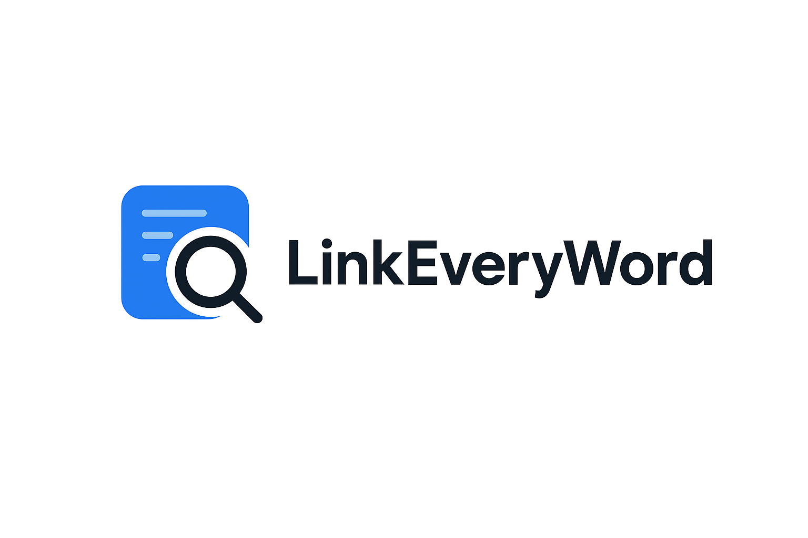

# LinkEveryWord

<p align="center"></p>

<p align="center">
  <a href="./README_ZH.md">简体中文</a>
</p>

**LinkEveryWord** is a comprehensive file search and link management solution designed to help you efficiently find and manage your digital files. This project includes a powerful desktop search application, a seamlessly integrated browser extension, and a web platform that is still in the planning stages.

## Project Components

This project consists of three main components, each with a different purpose:

### 🖥️ Desktop Application (Completed)

**Location**: [`/desktop-app/`](./desktop-app/)
**Technology**: `Python` `Flask` `Everything SDK` `PyInstaller`
**Description**: A powerful Windows desktop application powered by the Everything SDK, providing real-time local file search functionality. It features a modern web-based interface and can run as a standalone executable.

For more details, please refer to the [Desktop Application README](./desktop-app/README.md).

### 🌐 Chrome Extension (Completed)

**Location**: [`/chrome-extension/`](./chrome-extension/)
**Technology**: `React` `TypeScript` `shadcn/ui` `Plasmo`
**Description**: A Chrome browser extension that allows you to select text on any webpage and perform a real-time search using a customizable backend (such as the LinkEveryWord desktop application). The search results are displayed in a clean side panel.

For more details, please refer to the [Chrome Extension README](./chrome-extension/README.md).

### ☁️ Web Application (Completed)

**Location**: [`/web/`](./web/)
**Technology**: `Cloudflare Pages` `Hono` `TypeScript`
**Description**: A static website that introduces the project, provides installation guides for the Chrome extension and Desktop app, and hosts the Privacy Policy page.

For more details, please refer to the [Web Application README](./web/README.md).

## Development Status

| Component              | Status      | Progress | Description                                      |
| ---------------------- | ----------- | -------- | ------------------------------------------------ |
| **Desktop Application**| `v1.0.0`    | 100%     | Core functionality is stable and a release version is available. |
| **Chrome Extension**   | `v0.0.1`    | 100%     | Fully functional and ready for development and building. |
| **Web Application**    | `v0.1.0`    | 100%     | A static website for project introduction and guides. |

## Quick Start

### Desktop Application

1.  Go to the `desktop-app/dist` directory.
2.  Run the `EverythingFlaskSearch.exe` executable.
3.  Your browser will automatically open and display the search interface.

For development:
```bash
# Development mode
cd desktop-app
pip install flask flask-cors
python app_standalone.py
```

### Chrome Extension

1.  Go to the `chrome-extension` directory.
2.  Install dependencies: `npm install`
3.  Start the development server: `npm run dev`
4.  In Chrome, load the unpacked extension from the `build/chrome-mv3-dev` directory.

### Web Application

The web application is not yet in the development phase.

## Contribution Guidelines

1.  Fork this project.
2.  Create your feature branch (`git checkout -b feature/AmazingFeature`).
3.  Commit your changes (`git commit -m 'Add some AmazingFeature'`).
4.  Push to the branch (`git push origin feature/AmazingFeature`).
5.  Open a Pull Request.

## License

This project is licensed under the MIT License - see the [LICENSE](LICENSE) file for details.
